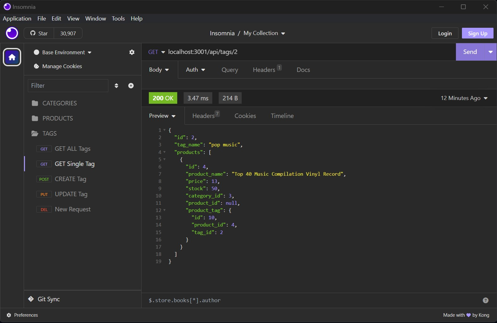
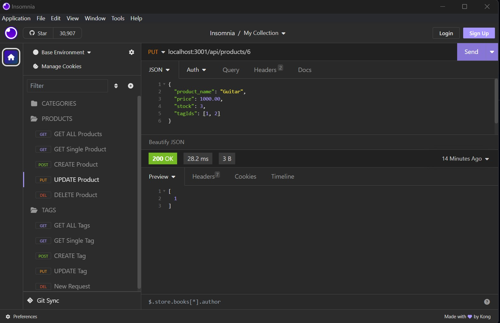

# online-retail-backend
Internet retail, commonly known as e-commerce, has revolutionized the electronics industry by providing 
a platform that empowers businesses and consumers to engage in the convenient buying and selling of 
electronic products online. This project focuses on building the back end for an e-commerce site, 
utilizing an Express.js API and configuring it to interact with a MySQL database using Sequelize. 

## User Story
```md
AS A manager at an internet retail company
I WANT a back end for my e-commerce website that uses the latest technologies
SO THAT my company can compete with other e-commerce companies
```
## Acceptance Criteria
```md
GIVEN a functional Express.js API
WHEN I add my database name, MySQL username, and MySQL password to an environment variable file
THEN I am able to connect to a database using Sequelize
WHEN I enter schema and seed commands
THEN a development database is created and is seeded with test data
WHEN I enter the command to invoke the application
THEN my server is started and the Sequelize models are synced to the MySQL database
WHEN I open API GET routes in Insomnia Core for categories, products, or tags
THEN the data for each of these routes is displayed in a formatted JSON
WHEN I test API POST, PUT, and DELETE routes in Insomnia Core
THEN I am able to successfully create, update, and delete data in my database
```
## Examples

Below are a few examples of the application in action. The images demonstrate examples of making a 
GET request to search for a tag with a given ID, and creating a PUT request to update a product 
within the database.

### GET Example


### PUT Example


## Link

Link to walk through video: https://drive.google.com/file/d/1FXdhRy2Xj9VTiMq0FerpENzL7wlYDA1N/view